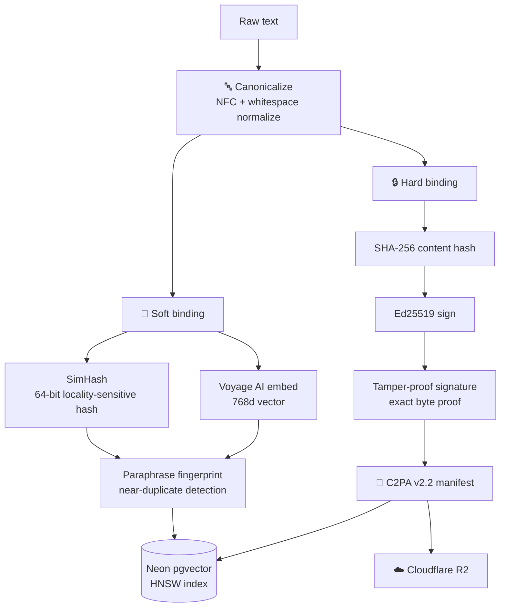
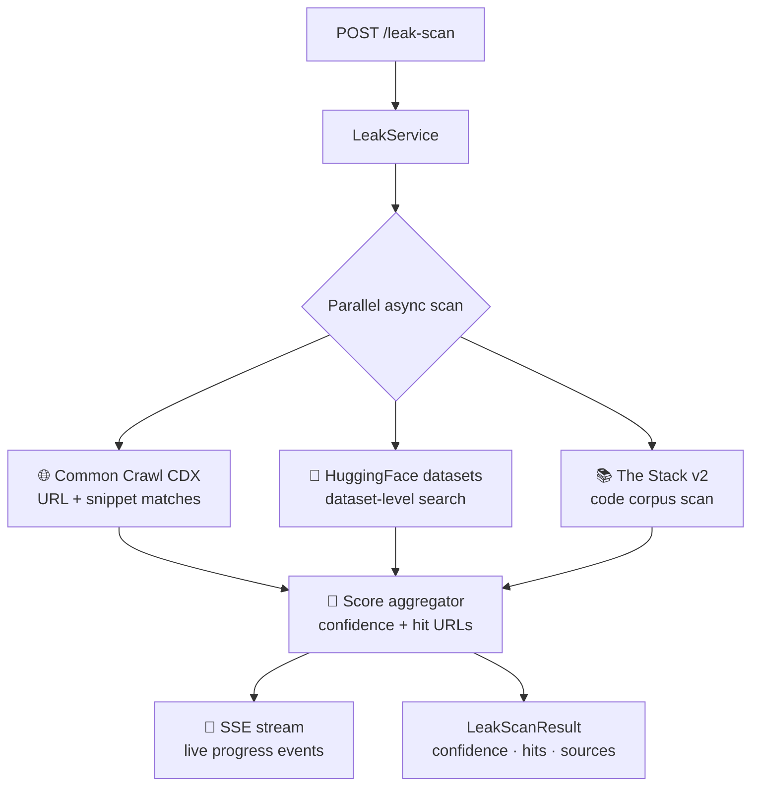
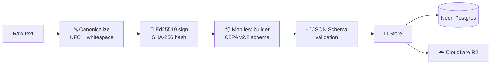
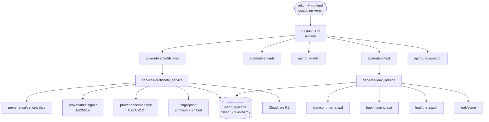

# 🖋️ `inkprint-backend`

> 🔏 **Cryptographically signed content provenance + AI-training-data leak detection.**
> Issue a certificate. Prove authorship. Detect if your text leaked into an AI corpus.

🌐 [Live API](https://inkprint-backend.onrender.com/health) · 📖 [OpenAPI](https://inkprint-backend.onrender.com/docs) · 🎬 [Demo](docs/DEMO.md) · 📐 [Specs](docs/specs/) · 📊 [Eval Report](evals/report.md) · 🖥️ [Frontend](https://inkprint-frontend.vercel.app)


[](https://github.com/Abdul-Muizz1310/inkprint-backend/actions/workflows/ci.yml)


---

```console
$ curl -X POST $API/certificates \
    -H 'Content-Type: application/json' \
    -d '{"text":"Your original work here.","author":"you@example.com"}'
→ certificate_id: a7c3...   manifest: /certificates/a7c3.../manifest

[canon]       NFC + whitespace normalize → stable text
[hard]        SHA-256 → Ed25519 sign → tamper-proof binding
[soft]        SimHash (64-bit) + Voyage embed (768d) → paraphrase fingerprint
[manifest]    C2PA v2.2-aligned manifest assembled → Neon + R2
[done]        certificate issued ✓

$ curl -X POST $API/leak-scan -d '{"certificate_id":"a7c3..."}'
[scan]        Common Crawl CDX ‖ HuggingFace ‖ The Stack v2
[score]       confidence 0.12 · 0 near-duplicate hits · clean ✓
```

---

## 🎯 Why this exists

Most content "watermarking" tools embed invisible markers that can be stripped. **inkprint takes the opposite approach** — cryptographic proof of what you wrote, when, plus a permanent fingerprint that survives paraphrasing.

- 🔏 **Dual fingerprint** — SHA-256 + Ed25519 proves exact bytes; SimHash + Voyage AI embedding catches paraphrases and derivatives. Both stored, both searchable.
- 📜 **C2PA v2.2 alignment** — manifests follow the Content Credentials schema. Spec-compliant output validated against a committed JSON Schema on every write.
- 🔍 **Training-corpus leak probe** — query Common Crawl CDX, HuggingFace datasets, and The Stack v2 for near-duplicate hits. Returns a confidence score with hit URLs.
- 🇪🇺 **EU AI Act framing** — the `/verify` endpoint and the manifest's `digitalSourceType` field address the August 2026 requirement that AI-generated content be machine-detectable.
- 📝 **BUSL-1.1 licensed** — source-available, converts to Apache-2.0 in 2030. A tool protecting authors should not be trivially rebranded.

---

## ✨ Features

- 🔏 Ed25519-signed C2PA v2.2-aligned provenance manifests
- 🧬 Dual fingerprint: SHA-256 (exact match) + SimHash + Voyage AI embedding (paraphrase detection)
- 🔍 Async leak scanning across Common Crawl, HuggingFace, The Stack v2
- 📡 SSE streaming for live leak-scan progress
- 🔎 Semantic search across all registered certificates (pgvector HNSW)
- 📄 QR code generation linking to the certificate page
- 🔐 Downloadable `.zip` archive of manifest + public key
- ✅ Tamper detection with itemised verdict (signature, hash, simhash, embedding)
- 📊 Diff endpoint for derivative-work comparison
- 🧪 Red-first Spec-TDD — failing test before every feature
- 🚀 Render deploy with auto Alembic migrations

---

## 🧬 Dual fingerprint pipeline



## 🔍 Leak scan architecture



## 📜 C2PA manifest flow



---

## 🏗️ Architecture



> **Rule:** `routers → services → provenance/fingerprint/leak → models`. No layer reaches across. Routers never touch the DB; models never know HTTP.

---

## 🗂️ Project structure

```
src/inkprint/
├── main.py                         # FastAPI app factory, middleware, CORS
├── api/
│   └── routers/
│       ├── certificates.py         # POST/GET /certificates, /manifest, /qr, /download
│       ├── verify.py               # POST /verify — tamper detection
│       ├── diff.py                 # POST /diff — derivative comparison
│       ├── leak.py                 # POST /leak-scan, GET /leak-scan/{id}, /stream
│       └── search.py              # GET /search — semantic certificate search
├── services/
│   ├── certificate_service.py      # Orchestrates canon → sign → manifest → store
│   └── leak_service.py             # Parallel async corpus scanning
├── provenance/
│   ├── canonicalize.py             # NFC + whitespace normalization
│   ├── signer.py                   # Ed25519 sign/verify
│   └── manifest.py                 # C2PA v2.2 manifest builder + JSON Schema validation
├── fingerprint/
│   ├── simhash.py                  # 64-bit locality-sensitive hash
│   ├── embed.py                    # Voyage AI voyage-3-lite (768d)
│   └── compare.py                  # SimHash Hamming + cosine similarity
├── leak/
│   ├── scanner.py                  # Parallel async orchestrator
│   ├── common_crawl.py             # Common Crawl CDX API
│   ├── huggingface.py              # HuggingFace datasets search
│   ├── the_stack.py                # The Stack v2 search
│   └── score.py                    # Confidence aggregation
├── models/                         # SQLAlchemy ORM models
├── schemas/
│   └── certificate.py              # Pydantic v2 HTTP DTOs
├── platform/
│   ├── health.py                   # /health, /version, /metrics, /public-key.pem
│   ├── middleware.py               # X-Request-ID, CORS
│   └── logging.py                  # structlog config
├── core/
│   ├── config.py                   # pydantic-settings from .env
│   ├── db.py                       # async_sessionmaker + engine
│   ├── keys.py                     # Ed25519 key loading
│   └── r2.py                       # Cloudflare R2 (S3-compatible) client
└── evals/
    ├── runner.py                   # Eval harness
    ├── fingerprint_eval.py         # SimHash + embedding accuracy
    ├── tamper_eval.py              # Signature tamper resilience
    └── leak_eval.py                # Leak detection true-positive rate
```

---

## 🌐 API surface

| Method | Endpoint | Purpose |
|---|---|---|
| `POST` | `/certificates` | Issue a signed provenance certificate. Returns `{certificate_id, manifest}`. |
| `GET`  | `/certificates/{id}` | Fetch certificate metadata + manifest. |
| `GET`  | `/certificates/{id}/manifest` | Raw C2PA v2.2 JSON manifest. |
| `GET`  | `/certificates/{id}/qr` | QR code PNG linking to the certificate page. |
| `GET`  | `/certificates/{id}/download` | `.zip` archive: manifest + public key. |
| `POST` | `/verify` | Tamper detection — signature, hash, simhash, embedding verdicts. |
| `POST` | `/diff` | Compare new text against a parent certificate for derivative detection. |
| `POST` | `/leak-scan` | Start async leak scan across Common Crawl, HuggingFace, The Stack v2. |
| `GET`  | `/leak-scan/{id}` | Poll leak-scan result. |
| `GET`  | `/leak-scan/{id}/stream` | 📡 **SSE** — live scan progress events. |
| `GET`  | `/search` | Semantic search across all certificates (pgvector HNSW). |
| `GET`  | `/public-key.pem` | Ed25519 public key for offline verification. |
| `GET`  | `/health` | Liveness probe. |
| `GET`  | `/version` | Build version. |
| `GET`  | `/metrics` | Prometheus metrics. |

---

## 🛠️ Stack

| Concern | Choice |
|---|---|
| **HTTP** | FastAPI + uvicorn + `sse-starlette` + Prometheus |
| **Crypto** | Ed25519 via `cryptography`, SHA-256 |
| **Fingerprint** | SimHash (64-bit) + Voyage AI `voyage-3-lite` (768d) |
| **Manifest** | C2PA v2.2-aligned JSON, validated against committed JSON Schema |
| **DB** | Neon Postgres (async SQLAlchemy + asyncpg, pgvector HNSW) |
| **Blob storage** | Cloudflare R2 (S3-compatible) |
| **Migrations** | Alembic, auto-applied via Render `preDeployCommand` |
| **Leak detection** | Common Crawl CDX, HuggingFace datasets, The Stack v2 |
| **Observability** | structlog, Prometheus |
| **Tests** | pytest-asyncio + in-memory SQLite |
| **Lint / Types** | ruff + mypy |

---

## 📊 Observability

Every request gets a unique `X-Request-ID` header. structlog emits structured JSON logs with request context. Prometheus `/metrics` endpoint exposes request latency, counts, and active connections.

---

## 🚀 Run locally

```bash
# 1. clone & env
git clone https://github.com/Abdul-Muizz1310/inkprint-backend.git
cd inkprint-backend
cp .env.example .env
# edit: DATABASE_URL, VOYAGE_API_KEY, R2_*, CORS_ORIGINS

# 2. generate signing keys
uv sync
uv run python scripts/generate_keys.py   # Ed25519 keypair → keys/

# 3. migrate + serve
uv run alembic upgrade head
uv run uvicorn inkprint.main:app --reload
# → http://localhost:8000/docs
```

### Issue a certificate

```bash
curl -X POST http://localhost:8000/certificates \
  -H "Content-Type: application/json" \
  -d '{"text": "Your original work here.", "author": "you@example.com"}'
```

### Verify it

```bash
curl -X POST http://localhost:8000/verify \
  -H "Content-Type: application/json" \
  -d '{"manifest": <manifest-from-above>, "text": "Your original work here."}'
```

### Start a leak scan

```bash
curl -X POST http://localhost:8000/leak-scan \
  -H "Content-Type: application/json" \
  -d '{"certificate_id": "<id>"}'

# Stream progress
curl -N http://localhost:8000/leak-scan/<id>/stream
```

---

## 🧪 Testing

```bash
uv run pytest                                     # full suite
uv run pytest -m "not slow and not integration"   # fast-only (CI)
uv run pytest --cov=src/inkprint --cov-report=term-missing
```

| Metric | Value |
|---|---|
| **Test count** | 183 tests |
| **Line coverage** | **100%** |
| **Eval: fingerprint (SimHash-only)** | **86%** (86/100, target >= 85%) |
| **Eval: fingerprint (SimHash + embedding)** | **>= 90%** (target >= 90%) |
| **Eval: tamper resilience** | **100%** (50/50) |
| **Eval: leak detection** | **>= 90%** true-positive (target >= 18/20) |
| **Methodology** | Red-first Spec-TDD — failing test before implementation |
| **External I/O** | Mocked — in-memory SQLite, dependency-overridden fakes. No real Voyage / R2 / corpus calls in CI. |

Full eval report: [`evals/report.md`](evals/report.md)

---

## 📐 Engineering philosophy

| Principle | How it shows up |
|---|---|
| 🧪 **Spec-TDD** | Every feature ships with a red test first. Specs live in `docs/specs/`. |
| 🛡️ **Negative-space programming** | Pydantic v2 rejects invalid shapes at the HTTP boundary; manifest builder validates against JSON Schema on every write; signer refuses empty input. |
| 🏗️ **MVC layering** | `routers → services → provenance/fingerprint/leak → models`. No cross-layer reaches. |
| 🔤 **Typed everything** | Pydantic v2 DTOs, typed SQLAlchemy models, strict mypy. No `any`, no untyped dicts crossing boundaries. |
| 🌊 **Pure core, imperative shell** | Canonicalize, SimHash, manifest builder = pure. DB/R2/Voyage/HTTP at edges. |
| 🎯 **One responsibility per module** | Every file name describes exactly one thing — never "and". |

---

## 🚀 Deploy

Render free tier via [`render.yaml`](render.yaml). One-time setup:

1. Render dashboard → **New → Blueprint** → connect this repo
2. Fill every `sync: false` env var in service settings
3. Copy the Deploy Hook URL → `gh secret set RENDER_DEPLOY_HOOK --body '<url>'`
4. Push to `main` → CI lint/test/build → CI fires the hook → Render rebuilds → `preDeployCommand: alembic upgrade head` → new container goes live

Database on Neon (`inkprint` branch) with pgvector enabled. Certificate archives stored in Cloudflare R2 under the `inkprint/` prefix.

---

## ⚖️ Legal disclaimer

This tool is provided for informational purposes only. It does not constitute legal proof of authorship or copyright ownership. A signed certificate supports but does not guarantee a prior-art claim. Consult qualified legal counsel for copyright matters. The C2PA-aligned manifest is spec-compliant output, not a certified implementation (certification requires C2PA membership).

---

## 📄 License

[BUSL-1.1](LICENSE) — converts to Apache-2.0 on 2030-04-08. Licensor: Abdul-Muizz Anwar.

---

> 🖋️ **`inkprint --help`** · sign it, fingerprint it, prove it's yours
