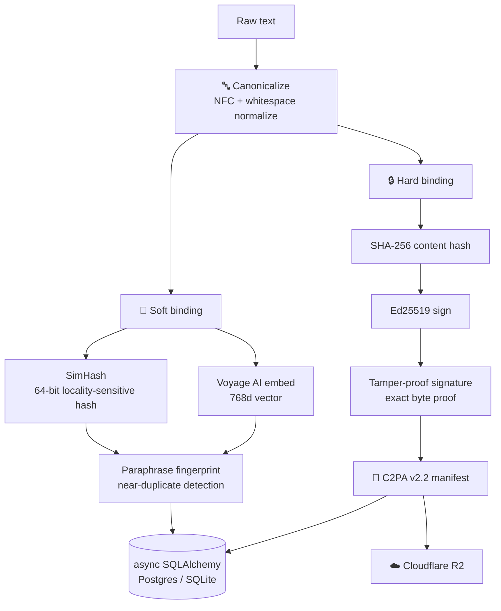
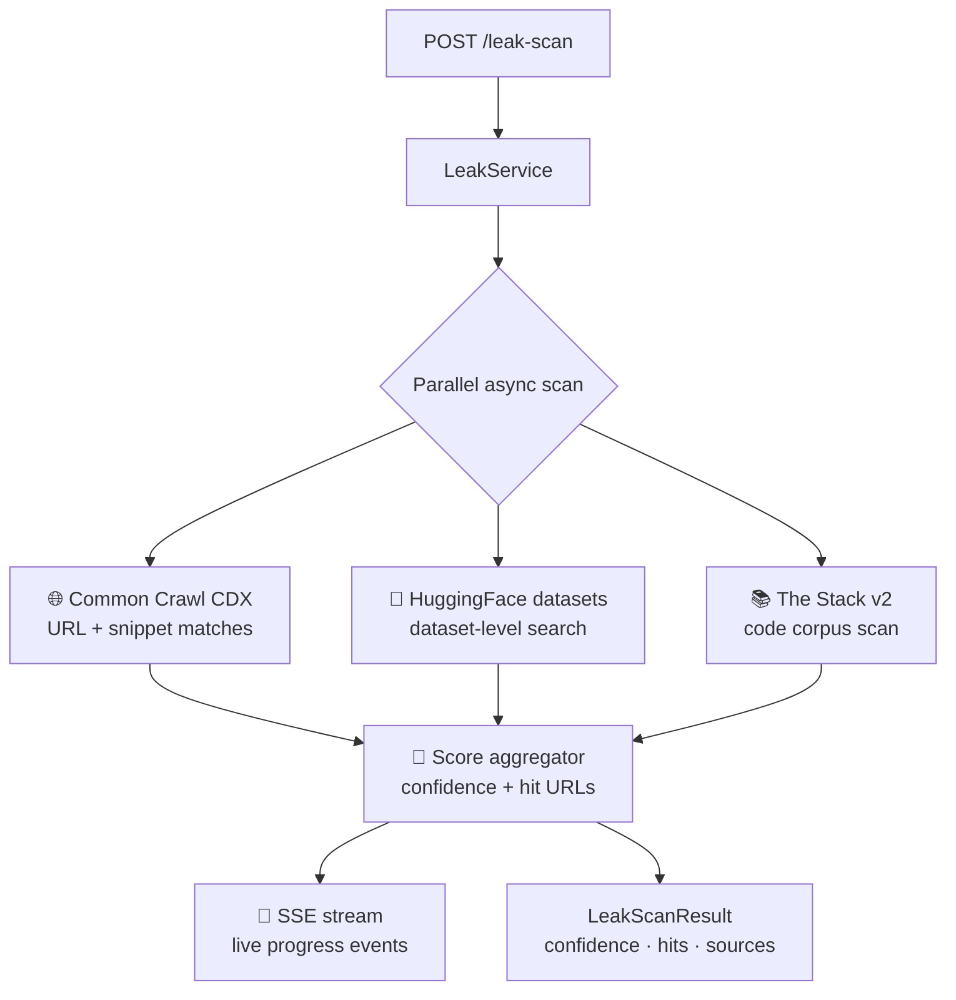
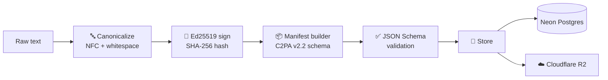
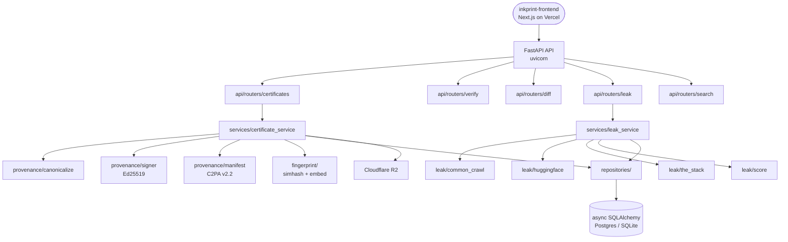

# 🖋️ `inkprint-backend`

> 🔏 **Cryptographically signed content provenance + AI-training-data leak detection.**
> Issue a certificate. Prove authorship. Detect if your text leaked into an AI corpus.

🌐 [Live API](https://inkprint-backend.onrender.com/health) · 📖 [OpenAPI](https://inkprint-backend.onrender.com/docs) · 🎬 [Demo](docs/DEMO.md) · 📐 [Specs](docs/specs/) · 📊 [Eval Report](evals/report.md) · 🖥️ [Frontend](https://inkprint-frontend.vercel.app)


[](https://github.com/Abdul-Muizz1310/inkprint-backend/actions/workflows/ci.yml)


---

```console
$ curl -X POST $API/certificates \
    -H 'Content-Type: application/json' \
    -d '{"text":"Your original work here.","author":"you@example.com"}'
→ certificate_id: a7c3...   manifest: /certificates/a7c3.../manifest

[canon]       NFC + whitespace normalize → stable text
[hard]        SHA-256 → Ed25519 sign → tamper-proof binding
[soft]        SimHash (64-bit) + Voyage embed (768d) → paraphrase fingerprint
[manifest]    C2PA v2.2-aligned manifest assembled → Neon + R2
[done]        certificate issued ✓

$ curl -X POST $API/leak-scan -d '{"certificate_id":"a7c3..."}'
[scan]        Common Crawl CDX ‖ HuggingFace ‖ The Stack v2
[score]       confidence 0.12 · 0 near-duplicate hits · clean ✓
```

---

## 🎯 Why this exists

Most content "watermarking" tools embed invisible markers that can be stripped. **inkprint takes the opposite approach** — cryptographic proof of what you wrote, when, plus a permanent fingerprint that survives paraphrasing.

- 🔏 **Dual fingerprint** — SHA-256 + Ed25519 proves exact bytes; SimHash + Voyage AI embedding catches paraphrases and derivatives. Both stored, both searchable.
- 📜 **C2PA v2.2 alignment** — manifests follow the Content Credentials schema. Spec-compliant output validated against a committed JSON Schema on every write (certificates against `c2pa_schema.json`, dossier envelopes against `c2pa_envelope_schema.json`).
- 🔍 **Training-corpus leak probe** — query Common Crawl CDX, HuggingFace datasets, and The Stack v2 for near-duplicate hits. Returns a confidence score with hit URLs.
- 🇪🇺 **EU AI Act framing** — the `/verify` endpoint and the manifest's `digitalSourceType` field address the August 2026 requirement that AI-generated content be machine-detectable.
- 📝 **BUSL-1.1 licensed** — source-available, converts to Apache-2.0 in 2030. A tool protecting authors should not be trivially rebranded.

---

## ✨ Features

- 🔏 Ed25519-signed C2PA v2.2-aligned provenance manifests
- 🧬 Dual fingerprint: SHA-256 (exact match) + SimHash + Voyage AI embedding (paraphrase detection)
- 🔍 Async leak scanning across Common Crawl, HuggingFace, The Stack v2
- 📡 SSE streaming for live leak-scan progress
- 🔎 Semantic search ranks registered certificates by embedding cosine similarity (real embeddings need a Voyage key; a pgvector ANN index is an optional production optimization)
- 📄 QR code generation linking to the certificate page
- 🔐 Downloadable `.zip` archive: manifest, public key, and the stored text — everything a recipient needs to verify offline
- ✅ Tamper detection with itemised **signature + hash** verdicts (`POST /verify`)
- 📦 Batch endpoints: issue up to 50 certificates atomically, or verify 50 at once
- 🗂️ Dossier envelopes — one signed C2PA manifest binding a bundle of evidence certificates
- 📊 Diff endpoint for derivative-work comparison
- 🧪 Red-first Spec-TDD — failing test before every feature
- 🚀 Render deploy; Alembic migrations applied by the container entrypoint on every boot

---

## 🧬 Dual fingerprint pipeline


```mermaid
flowchart TD
    Input[Raw text] --> Canon[🔤 Canonicalize<br/>NFC + whitespace normalize]
    Canon --> Hard[🔒 Hard binding]
    Canon --> Soft[🧠 Soft binding]

    Hard --> SHA[SHA-256 content hash]
    SHA --> Sign[Ed25519 sign]
    Sign --> HardOut[Tamper-proof signature<br/>exact byte proof]

    Soft --> SH[SimHash<br/>64-bit locality-sensitive hash]
    Soft --> Embed[Voyage AI embed<br/>768d vector]
    SH --> SoftOut[Paraphrase fingerprint<br/>near-duplicate detection]
    Embed --> SoftOut

    HardOut --> Manifest[📜 C2PA v2.2 manifest]
    SoftOut --> DB[(async SQLAlchemy<br/>Postgres / SQLite)]
    Manifest --> DB
    Manifest --> R2[☁️ Cloudflare R2]
```

## 🔍 Leak scan architecture


```mermaid
flowchart TD
    Req[POST /leak-scan] --> Svc[LeakService]
    Svc --> Par{Parallel async scan}
    Par --> CC[🌐 Common Crawl CDX<br/>URL + snippet matches]
    Par --> HF[🤗 HuggingFace datasets<br/>dataset-level search]
    Par --> Stack[📚 The Stack v2<br/>code corpus scan]
    CC --> Agg[🧮 Score aggregator<br/>confidence + hit URLs]
    HF --> Agg
    Stack --> Agg
    Agg --> SSE[📡 SSE stream<br/>live progress events]
    Agg --> Result[LeakScanResult<br/>confidence · hits · sources]
```

## 📜 C2PA manifest flow


```mermaid
flowchart LR
    Text[Raw text] --> Canon[🔤 Canonicalize<br/>NFC + whitespace]
    Canon --> Sign[🔏 Ed25519 sign<br/>SHA-256 hash]
    Sign --> Build[📦 Manifest builder<br/>C2PA v2.2 schema]
    Build --> Validate[✅ JSON Schema<br/>validation]
    Validate --> Store[💾 Store]
    Store --> DB[(Neon Postgres)]
    Store --> R2[☁️ Cloudflare R2]
```

---

## 🏗️ Architecture


```mermaid
flowchart TD
    Client([inkprint-frontend<br/>Next.js on Vercel]) --> API[FastAPI API<br/>uvicorn]
    API --> Certs[api/routers/certificates]
    API --> Verify[api/routers/verify]
    API --> Diff[api/routers/diff]
    API --> Leak[api/routers/leak]
    API --> Search[api/routers/search]

    Certs --> CertSvc[services/certificate_service]
    Leak --> LeakSvc[services/leak_service]

    CertSvc --> Canon[provenance/canonicalize]
    CertSvc --> Signer[provenance/signer<br/>Ed25519]
    CertSvc --> Manifest[provenance/manifest<br/>C2PA v2.2]
    CertSvc --> FP[fingerprint/<br/>simhash + embed]

    LeakSvc --> CC[leak/common_crawl]
    LeakSvc --> HF[leak/huggingface]
    LeakSvc --> Stack[leak/the_stack]
    LeakSvc --> Score[leak/score]

    CertSvc --> Repo[repositories/]
    Repo --> DB[(async SQLAlchemy<br/>Postgres / SQLite)]
    CertSvc --> R2[Cloudflare R2]
    LeakSvc --> Repo
```

> **Rule:** `routers → services → provenance/fingerprint/leak → models`. No layer reaches across. Routers never touch the DB; models never know HTTP.

---

## 🗂️ Project structure

```
src/inkprint/
├── main.py                         # FastAPI app factory, middleware, CORS
├── api/
│   └── routers/
│       ├── certificates.py         # POST/GET /certificates, /manifest, /qr, /download
│       ├── batch.py                # POST /certificates/batch, POST /verify/batch
│       ├── dossiers.py             # POST /dossiers/envelope
│       ├── verify.py               # POST /verify — tamper detection
│       ├── diff.py                 # POST /diff — derivative comparison
│       ├── leak.py                 # POST /leak-scan, GET /leak-scan/{id}, /stream
│       └── search.py               # GET /search — semantic certificate search
├── services/
│   ├── certificate_service.py      # Orchestrates canon → sign → manifest → store
│   ├── batch_service.py            # Atomic N-certificate issue + batch verify
│   ├── envelope_service.py         # Dossier envelope build → sign → validate → store
│   └── leak_service.py             # Parallel async corpus scanning
├── repositories/                   # All DB access; services call these, routers never do
│   ├── certificate_repo.py         # Certificates + derivative links
│   ├── envelope_repo.py            # Dossier envelopes
│   └── leak_repo.py                # Leak-scan jobs, results, 7-day cache
├── provenance/
│   ├── canonicalize.py             # NFC + whitespace normalization
│   ├── signer.py                   # Ed25519 sign/verify (refuses empty input)
│   ├── manifest.py                 # C2PA v2.2 manifest builder + JSON Schema validation
│   ├── envelope_builder.py         # Pure envelope bundle/manifest builder + schema validation
│   ├── c2pa_schema.json            # Committed certificate-manifest schema
│   └── c2pa_envelope_schema.json   # Committed envelope-manifest schema
├── fingerprint/
│   ├── simhash.py                  # 64-bit locality-sensitive hash
│   ├── embed.py                    # Voyage AI voyage-3-lite (768d)
│   └── compare.py                  # SimHash Hamming + cosine similarity
├── leak/
│   ├── scanner.py                  # Parallel async orchestrator
│   ├── common_crawl.py             # Common Crawl CDX API
│   ├── huggingface.py              # HuggingFace datasets search
│   ├── the_stack.py                # The Stack v2 search
│   └── score.py                    # Confidence aggregation
├── models/                         # SQLAlchemy ORM models (certificates, leak, envelope)
├── schemas/
│   ├── certificate.py              # Pydantic v2 HTTP DTOs
│   ├── batch.py                    # Batch create/verify DTOs
│   ├── envelope.py                 # Dossier envelope DTOs
│   └── validators.py               # Shared field validators (canonical-content guard)
├── platform/
│   ├── health.py                   # /health, /version, /public-key.pem, commit-SHA resolution
│   ├── middleware.py               # X-Request-ID, CORS
│   ├── rate_limit.py               # Per-IP fixed-window throttle on write/scan routes
│   ├── platform_token.py           # X-Platform-Token JWT validator (bastion integration)
│   └── logging.py                  # stdlib JSON logging config
├── core/
│   ├── config.py                   # pydantic-settings from .env
│   ├── db.py                       # async_sessionmaker + engine
│   ├── keys.py                     # Ed25519 key loading
│   └── r2.py                       # Cloudflare R2 (S3-compatible) client + archival
└── evals/
    ├── runner.py                   # Eval harness
    ├── fingerprint_eval.py         # SimHash-only accuracy (no embedding evaluator yet)
    ├── tamper_eval.py              # Signature tamper resilience
    └── leak_eval.py                # Leak detection true-positive rate
```

> `/metrics` is exposed by `prometheus-fastapi-instrumentator`, wired in `main.py`.

---

## 🌐 API surface

| Method | Endpoint | Purpose |
|---|---|---|
| `POST` | `/certificates` | Issue a signed provenance certificate. Returns `{certificate_id, manifest}`. |
| `GET`  | `/certificates/{id}` | Fetch certificate metadata + manifest. |
| `GET`  | `/certificates/{id}/manifest` | Raw C2PA v2.2 JSON manifest. |
| `GET`  | `/certificates/{id}/qr` | QR code PNG linking to the certificate page. |
| `GET`  | `/certificates/{id}/download` | `.zip` archive: `manifest.json` + `public_key.pem` + `content.txt` (the stored text). |
| `POST` | `/certificates/batch` | Issue 1–50 certificates atomically. All-or-nothing: any failure persists none of them. |
| `POST` | `/verify` | Tamper detection — **signature + hash** verdicts over the submitted manifest and text. |
| `POST` | `/verify/batch` | Verify 1–50 certificates by id. Adds `simhash` and `embedding` verdicts for items that supply `text`; unknown ids fail softly with `reason: "unknown_certificate"`. |
| `POST` | `/dossiers/envelope` | Sign one C2PA-aligned envelope manifest over a bundle of evidence certificates plus a debate-transcript and perf-receipt hash. Idempotent per `dossier_id`; a different bundle for the same id returns 409. |
| `POST` | `/diff` | Compare new text against a parent certificate for derivative detection. |
| `POST` | `/leak-scan` | Start async leak scan across Common Crawl, HuggingFace, The Stack v2. |
| `GET`  | `/leak-scan/{id}` | Poll leak-scan result. |
| `GET`  | `/leak-scan/{id}/stream` | 📡 **SSE** — live scan progress events. |
| `GET`  | `/search` | Search certificates — exact by content hash, or semantic by embedding cosine similarity. |
| `GET`  | `/public-key.pem` | Ed25519 public key for offline verification. |
| `GET`  | `/health` | Liveness probe. |
| `GET`  | `/version` | Build version. |
| `GET`  | `/metrics` | Prometheus metrics. |

---

## 🛠️ Stack

| Concern | Choice |
|---|---|
| **HTTP** | FastAPI + uvicorn + Prometheus. SSE is hand-rolled on Starlette's `StreamingResponse` (no `sse-starlette` dependency). |
| **Crypto** | Ed25519 via `cryptography`, SHA-256 |
| **Fingerprint** | SimHash (64-bit) + Voyage AI `voyage-3-lite` (768d) |
| **Manifest** | C2PA v2.2-aligned JSON, validated against committed JSON Schema |
| **DB** | async SQLAlchemy 2.0 — asyncpg/Neon Postgres in production, `aiosqlite` SQLite as the zero-config local default. Embeddings stored as a JSON array; pgvector ANN is an optional production index. |
| **Blob storage** | Cloudflare R2 (S3-compatible) |
| **Migrations** | Alembic. `docker-entrypoint.sh` runs `alembic upgrade head` before starting uvicorn, so every deploy brings the schema to head. (Render pre-deploy commands need a paid instance type; this service is on `free`, so the migration step lives in the container.) |
| **Leak detection** | Common Crawl CDX, HuggingFace datasets, The Stack v2 |
| **Observability** | stdlib structured JSON logging, Prometheus |
| **Tests** | pytest-asyncio. Fast tier on in-memory SQLite; a `postgres`-marked tier runs the same flows against a real Postgres (`pgvector/pgvector:pg17`) via Testcontainers, including the full Alembic chain. |
| **Lint / Types** | ruff + mypy |

---

## 📊 Observability

Every request gets a unique `X-Request-ID` header. The stdlib logging config emits structured JSON logs in production. Prometheus `/metrics` endpoint exposes request latency, counts, and active connections.

---

## 🚀 Run locally

```bash
# 1. clone & install
git clone https://github.com/Abdul-Muizz1310/inkprint-backend.git
cd inkprint-backend
uv sync

# 2. signing keys (optional — ephemeral keys are generated at startup if absent)
uv run python scripts/generate_keys.py   # Ed25519 keypair → keys/

# 3. serve — no config required; persists to a local SQLite file by default,
#    and the schema is created automatically on startup
uv run uvicorn inkprint.main:app --reload
# → http://localhost:8000/docs
```

For a production-like setup, copy `.env.example` to `.env` and set
`DATABASE_URL` to a Neon/Postgres DSN, then `uv run alembic upgrade head`
(the migrations enable pgvector and are Postgres-targeted; SQLite uses the
startup auto-create above). Set `VOYAGE_API_KEY` to compute real embeddings so
semantic search ranks meaningfully, and `R2_*` to archive certificate blobs.

### Issue a certificate

```bash
curl -X POST http://localhost:8000/certificates \
  -H "Content-Type: application/json" \
  -d '{"text": "Your original work here.", "author": "you@example.com"}'
```

### Verify it

```bash
curl -X POST http://localhost:8000/verify \
  -H "Content-Type: application/json" \
  -d '{"manifest": <manifest-from-above>, "text": "Your original work here."}'
```

### Start a leak scan

```bash
curl -X POST http://localhost:8000/leak-scan \
  -H "Content-Type: application/json" \
  -d '{"certificate_id": "<id>"}'

# Stream progress
curl -N http://localhost:8000/leak-scan/<id>/stream
```

---

## 🧪 Testing

```bash
uv run pytest                                   # everything (needs Docker for the postgres tier)
uv run pytest -m "not slow and not postgres"    # the CI selector — no Docker required
uv run pytest -m postgres                       # real Postgres via Testcontainers (needs Docker)
uv run pytest --cov=src/inkprint --cov-report=term-missing
```

Three tiers:

- **unit** — pure functions and DTOs.
- **integration** — wired end-to-end through the ASGI app (routers → services → repositories) on
  in-memory SQLite. No Docker, no Postgres; runs in the default CI job so the coverage gate
  measures the router and service layers.
- **postgres** — the same flows against a real Postgres (`pgvector/pgvector:pg17`) via
  Testcontainers, plus the whole Alembic chain. Self-skips without Docker; its own CI job. This is
  the only tier that sees production's JSONB / `UUID[]` / BYTEA / `TIMESTAMPTZ` behaviour — SQLite
  is forgiving about all four.

| Metric | Value |
|---|---|
| **Test count** | 417 tests |
| **Line coverage** | **98.29%** |
| **Eval: fingerprint (SimHash-only)** | **86%** (86/100, target >= 85%) — measured, reproducible via `uv run python evals/run_evals.py` |
| **Eval: fingerprint (SimHash + embedding)** | Not measured. No combined evaluator exists (`evals/fingerprint_eval.py` is SimHash-only); >= 90% is a design target, not a result — see [`evals/report.md`](evals/report.md) |
| **Eval: tamper resilience** | **100%** (50/50) — measured |
| **Eval: leak detection** | Live-only acceptance test (target >= 18/20 TP, <= 2 FP against live Common Crawl) — see [`evals/report.md`](evals/report.md); not yet run against production CDX |
| **Methodology** | Red-first Spec-TDD — failing test before implementation |
| **External I/O** | Mocked in the fast tiers — dependency-overridden fakes; no real Voyage / R2 / corpus calls in CI. The `postgres` tier uses a real database (a throwaway Testcontainers instance, never Neon). |

Full eval report: [`evals/report.md`](evals/report.md)

---

## 📐 Engineering philosophy

| Principle | How it shows up |
|---|---|
| 🧪 **Spec-TDD** | Every feature ships with a red test first. Specs live in `docs/specs/`. |
| 🛡️ **Negative-space programming** | Pydantic v2 rejects invalid shapes at the HTTP boundary — including text that *canonicalizes* to zero bytes, not merely the empty string. Certificate and envelope manifests are each validated against their own committed JSON Schema on every write. `sign()` refuses empty input outright, so the guard holds even for a caller that bypasses the DTOs. |
| 🏗️ **MVC layering** | `routers → services → provenance/fingerprint/leak → models`. No cross-layer reaches. |
| 🔤 **Typed everything** | Pydantic v2 DTOs, typed SQLAlchemy models, strict mypy. No `any`, no untyped dicts crossing boundaries. |
| 🌊 **Pure core, imperative shell** | Canonicalize, SimHash, manifest builder = pure. DB/R2/Voyage/HTTP at edges. |
| 🎯 **One responsibility per module** | Every file name describes exactly one thing — never "and". |

---

## 🚀 Deploy

Render free tier via [`render.yaml`](render.yaml). One-time setup:

1. Render dashboard → **New → Blueprint** → connect this repo
2. Fill every `sync: false` env var in service settings
3. *(optional)* Set the repository **variable** `SMOKE_BASE_URL` to the deployed
   service's bare origin — e.g. `https://inkprint-backend.onrender.com`, no
   trailing slash and no `/health`; `scripts/smoke_health.py` appends the path
   itself — so CI's post-deploy smoke job polls it. A variable, not a secret:
   the value is a public URL, and secrets are unavailable to fork PRs. Left
   unset, that job prints a notice and passes without making a single request —
   the free instance is often cold, and an unconditional probe would fail
   unrelated pull requests.

Then: push to `main` → CI runs lint / test / real-Postgres tier / docker build →
Render auto-deploys `main` on push (there is **no** CI deploy hook; the deploy job
was removed) → the container entrypoint runs `alembic upgrade head` → uvicorn starts →
CI's smoke job polls `/health` if a URL was configured.

Database on Neon (`inkprint` branch). Semantic search ranks embeddings with pure-Python cosine over stored JSON vectors; a pgvector ANN index is an optional production optimization, not currently wired. Certificate archives are uploaded to Cloudflare R2 when `R2_*` is configured — by both the single and the batch path (best-effort; archival never blocks certificate creation). With R2 unconfigured, `storage_key` degrades to the logical `certificates/{id}.json` key, which names where the blob *would* live rather than a live object.

---

## ⚖️ Legal disclaimer

This tool is provided for informational purposes only. It does not constitute legal proof of authorship or copyright ownership. A signed certificate supports but does not guarantee a prior-art claim. Consult qualified legal counsel for copyright matters. The C2PA-aligned manifest is spec-compliant output, not a certified implementation (certification requires C2PA membership).

---

## 📄 License

[BUSL-1.1](LICENSE) — converts to Apache-2.0 on 2030-04-08. Licensor: Abdul-Muizz Anwar.

---

> 🖋️ **`inkprint --help`** · sign it, fingerprint it, prove it's yours
