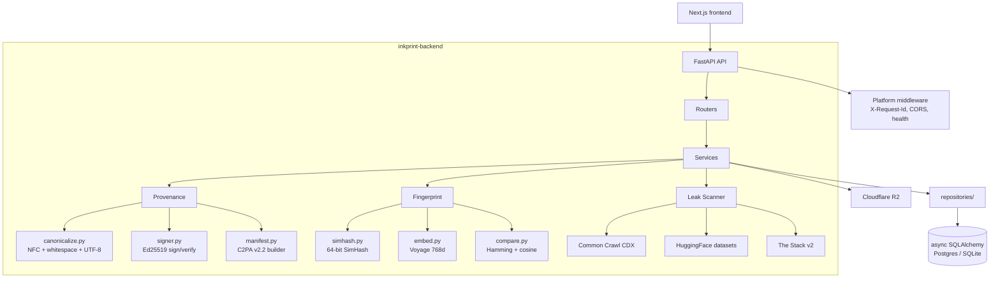
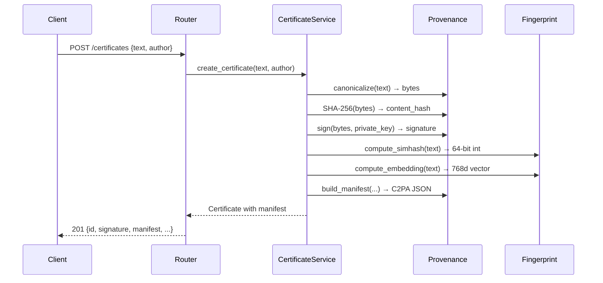

# Architecture

## System diagram



## Request flow: certificate issuance



## Layers

| Layer | Path | Responsibility |
|---|---|---|
| **API** | `src/inkprint/api/routers/` | HTTP routing, request validation, status codes |
| **Schemas** | `src/inkprint/schemas/` | Pydantic v2 request/response models |
| **Services** | `src/inkprint/services/` | Business logic orchestration; open a `session_scope()` and delegate to repositories |
| **Repositories** | `src/inkprint/repositories/` | All DB access — certificates, derivative links, leak jobs/results |
| **Provenance** | `src/inkprint/provenance/` | Canonicalization, hashing, Ed25519 signing, C2PA manifest |
| **Fingerprint** | `src/inkprint/fingerprint/` | SimHash, Voyage embeddings, comparison/verdict |
| **Leak** | `src/inkprint/leak/` | Corpus scanners (CC, HF, Stack), scoring, orchestrator |
| **Core** | `src/inkprint/core/` | Config, async DB engine + `session_scope`, R2 client, key loading |
| **Platform** | `src/inkprint/platform/` | Health, version, public-key, middleware |
| **Models** | `src/inkprint/models/` | SQLAlchemy ORM models (certificates, derivative_links, leak_scan_jobs, leak_scans, dossier_envelopes) |
| **Evals** | `src/inkprint/evals/` | Evaluation runners (fingerprint, tamper, leak) |

## Key design decisions

- **MVC layering** — routers never touch storage; they call services. Services open a committed `session_scope()` and delegate persistence to the repositories. Domain modules (canonicalize, sign, fingerprint, score) stay pure.
- **DB-backed persistence with a zero-config local default** — certificates, batches, and leak-scan jobs/results persist through async SQLAlchemy. When `DATABASE_URL` is unset the engine falls back to a local SQLite file (`aiosqlite`), so the service runs and persists without Postgres; production points `DATABASE_URL` at Neon. The lifespan creates the schema on SQLite; Postgres uses Alembic. (The dossier-envelope record is the one store still held in memory; its ORM model exists and DB-backing it is a follow-up.)
- **Semantic search ranking** — embeddings are stored as a JSON array and ranked by in-Python cosine similarity, so correctness needs no pgvector; a pgvector ANN index is an optional production index, and ranking quality depends on a real Voyage embedding backend.
- **Leak scan is a real background task** — `POST /leak-scan` returns a pending job and schedules `run_scan`, which resolves the certificate, runs the corpus orchestrator, and persists per-corpus results. Live hits require network access to Common Crawl / HuggingFace / The Stack; offline the scan still completes with zero hits.
- **Ephemeral keys in dev** — when signing key env vars are absent, the app generates a fresh Ed25519 keypair at startup. Production keys come from env.
- **Zero-vector embedding fallback** — when Voyage API is unavailable (no key), embeddings default to zero vectors. SimHash still works.
- **Async leak scanning** — each corpus scans in parallel with timeout + retry. The Stack v2 gracefully degrades if HF token is absent.

## API routes

```
POST   /certificates                  201 → Certificate
GET    /certificates/{id}             200 → Certificate
GET    /certificates/{id}/manifest    200 → C2PA manifest
GET    /certificates/{id}/qr          200 → image/png
GET    /certificates/{id}/download    200 → original text
POST   /verify                        200 → VerifyResult
POST   /diff                          200 → DiffResult
POST   /leak-scan                     202 → LeakScanJob
GET    /leak-scan/{id}                200 → LeakScanResult
GET    /leak-scan/{id}/stream         200 → SSE
GET    /search?text=...&mode=...      200 → CertificateList
GET    /public-key.pem                200 → text/plain
GET    /health                        200 → HealthResponse
GET    /version                       200 → commit SHA
GET    /metrics                       200 → Prometheus
```
